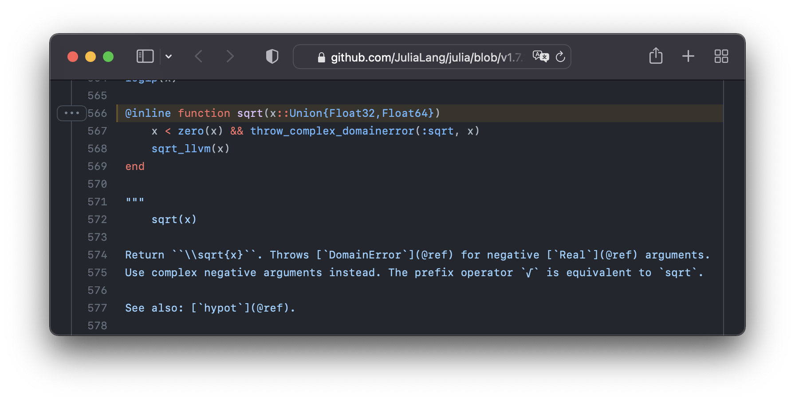

# BrowserMacros.jl

[![][docs-im]][docs] [![][docs-dev-im]][docs-dev] [![][ci-im]][ci] [![][cov-im]][cov]

---
A collection of Julia macros to access your browser from the comfort of your REPL.  

⚠️ This package is in early development, so there might be edge-cases to iron out. ⚠️

## Installation 
This package hasn't been registered yet.
To install it, open the Julia REPL and run 
```julia-repl
julia> ]add https://github.com/adrhill/BrowserMacros.jl
```

## Examples
### GitHub tools
The macro `@wwwhich` (world-wide-`which`) followed by a method call will open a new GitHub tab in your browser, showing the exact line of code that is run:
```julia
@wwwhich sqrt(2.0) 
```

This also works with code from external packages!



<!-- GitHub's git blame view can be opened in the same fashion:
```julia
@blame exp(5) 
``` 
-->

### Search engines
Google search and DuckDuckGo can be queried from your REPL:
```julia
@google "Why is julialang called Julia?"  
```

Since these are regular queries, [DuckDuckGo's bangs](https://duckduckgo.com/bang) are supported, e.g. to search for papers on Google Scholar: 
```julia
@dgg "!scholar Julia - A Fresh Approach to Numerical Computing"                     
```

## How does it work?
BrowserMacros constructs URLs and opens them using [DefaultApplication.jl](https://github.com/tpapp/DefaultApplication.jl). 
For `@wwwhich`, we make use of `Base.which` and look up modules in the Registry to find matching GitHub repositories.

## To-Do
We would love to support packages hosted on GitLab, SourceHut & Co.

Contributions are very welcome!

[docs-im]: https://img.shields.io/badge/docs-stable-blue.svg
[docs]: hhttps://adrhill.github.io/BrowserMacros.jl/stable/

[docs-dev-im]: https://img.shields.io/badge/docs-main-blue.svg
[docs-dev]: https://adrhill.github.io/BrowserMacros.jl/dev/

[ci-im]: https://github.com/adrhill/BrowserMacros.jl/actions/workflows/CI.yml/badge.svg?branch=main
[ci]: https://github.com/adrhill/BrowserMacros.jl/actions/workflows/CI.yml?query=branch%3Amain

[cov-im]: https://codecov.io/gh/adrhill/BrowserMacros.jl/branch/main/graph/badge.svg
[cov]: https://codecov.io/gh/adrhill/BrowserMacros.jl